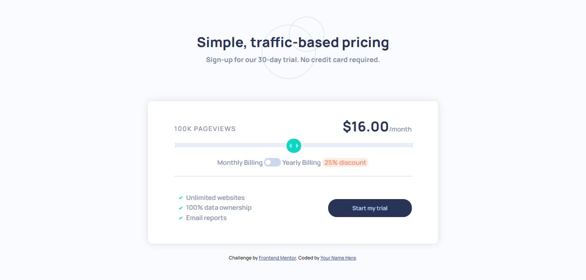

# Frontend Mentor - Interactive pricing component solution

This is a solution to the [Interactive pricing component challenge on Frontend Mentor](https://www.frontendmentor.io/challenges/interactive-pricing-component-t0m8PIyY8). Frontend Mentor challenges help you improve your coding skills by building realistic projects. 

## Table of contents

- [Overview](#overview)
  - [The challenge](#the-challenge)
  - [Screenshot](#screenshot)
  - [Links](#links)
- [My process](#my-process)
  - [Built with](#built-with)
  - [Useful resources](#useful-resources)
- [Author](#author)
- [Acknowledgments](#acknowledgments)

## Overview

### The challenge

Users should be able to:

- View the optimal layout for the app depending on their device's screen size
- See hover states for all interactive elements on the page
- Use the slider and toggle to see prices for different page view numbers

### Screenshot

### Links

- Solution URL: [Solution Code](https://github.com/Jorge644240/Interactive-pricing-component-main)
- Live Site URL: [Live result](https://jorge644240.github.io/Interactive-pricing-component-main)

## My process

### Built with

- Semantic HTML5 markup
- CSS custom properties
- Flexbox
- Desktop-first workflow

<!-- ### Continued development

Use this section to outline areas that you want to continue focusing on in future projects. These could be concepts you're still not completely comfortable with or techniques you found useful that you want to refine and perfect.

**Note: Delete this note and the content within this section and replace with your own plans for continued development.** -->

### Useful resources

- [Creating a toggle switch](https://www.w3schools.com/howto/howto_css_switch.asp) - This helped me in creating the toggle switch for "Monthly billing/Yearly billing". I really liked this pattern and will use it going forward.

## Author

- Website - [Jorge Gallego](https://jorge644240.github.io)
- Frontend Mentor - [@Jorge644240](https://www.frontendmentor.io/profile/Jorge644240)

## Acknowledgments

Special thanks to [W3Schools](https://www.w3schools.com/). Great learning platform, with incredible docs on a lot of programming languages and concepts.